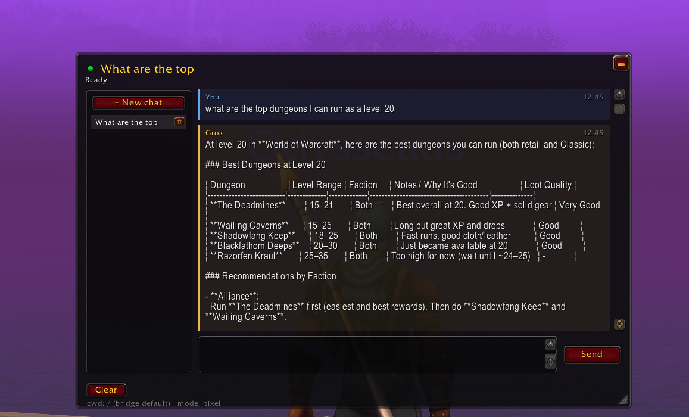
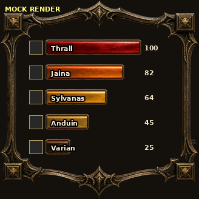
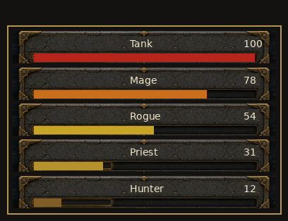

# wow-addons

World of Warcraft: Forever addons by Odysseaus, built for the classic beta client (Interface `16001`). Each addon has its own folder, README, and GitHub Releases tag.

## Index

| Addon | Folder | Status | Get it |
|-------|--------|--------|--------|
| [WoW Grok](#wow-grok) | [`wow-grok/`](wow-grok/) | Released (Mac app, Windows app, addon zip) | [Releases](https://github.com/Odysseaus/wow-addons/releases) (`wow-grok-mac-v…`, `wow-grok-win-v…`) |
| [WoW Threat](#wow-threat) | [`wow-threat/`](wow-threat/) | Released | [`wow-threat-v0.1.23`](https://github.com/Odysseaus/wow-addons/releases/tag/wow-threat-v0.1.23) |
| [QuestGrind](#questgrind) | [`quest-grind/`](quest-grind/) | 🚧 Under construction, not released | No release yet |

## Where AddOns go

For any addon you install by copying a folder, put the folder in your AddOns directory:

- **Mac:** `/Applications/World of Warcraft/_classic_beta_/Interface/AddOns/`
- **Windows:** `C:\Program Files (x86)\World of Warcraft\_classic_beta_\Interface\AddOns\`. Your drive letter or install folder may be different.

Then type `/reload` in game. If the game wasn't running, or the addon is brand new and doesn't show up, fully quit and relaunch WoW, then check that it's enabled under **AddOns** at character select.

---

## WoW Grok

Folder: [`wow-grok/`](wow-grok/) · In-game addon: [`wow-grok/addon/WoWGrok/`](wow-grok/addon/WoWGrok/) · Full README: [`wow-grok/README.md`](wow-grok/README.md)

Chat with your xAI Grok (API chat) from inside the game. Send a task, keep questing, and get pinged in game when the answer lands. Claude (Anthropic key) is an optional provider. A companion app on your Mac or Windows PC sends your message to the API with **your** key. Addons can't go online, so the app reads a strip of colored pixels the addon draws on screen and writes replies back into AddOn files the game loads.

- Open it with `/wow-grok` or `/grok` (also `/ai`, `/ask`).
- Shift-click items, spells, and quests into the input to insert links.
- Multiple chats, a status light, and reply recovery.
- The addon list shows version `0.1.22` (Author: chelinho139). It's based on the MIT [wow-claude](https://github.com/chelinho139/wow-claude), with the companion bridge rewritten in Python.
- **Not supported:** GeForce Now, Shadow, or any cloud or streaming WoW. The app must run on the same computer as a normal local WoW install.

  

<em>The WoW Grok chat window in game.</em>

  

<em>The same chat window in upstream wow-claude (this image comes from that project).</em>

### Download & install

WoW Grok installs differently from the other addons. **Don't copy the folder by hand.** Download the companion app. It finds your AddOns folder (or asks you for it), writes the `WoWGrok` addon plus its reply slots (`WoWGrok_S001`–`WoWGrok_S200`), and then keeps running as the bridge while you play. You need an API key from [console.x.ai](https://console.x.ai/) (the default), or a Claude key. Mac and Windows are separate downloads.

**Mac** ([step by step](wow-grok/docs/INSTALL-MAC.md))

1. From [Releases](https://github.com/Odysseaus/wow-addons/releases), get the newest `wow-grok-mac-v…` build: `WoWGrok.dmg` or `WoWGrok-mac-arm64.zip`. Right now [`wow-grok-mac-v0.1.31`](https://github.com/Odysseaus/wow-addons/releases/tag/wow-grok-mac-v0.1.31) is marked pre-release and [`wow-grok-mac-v0.1.30`](https://github.com/Odysseaus/wow-addons/releases/tag/wow-grok-mac-v0.1.30) is the newest full release. Both are Apple Silicon (arm64) builds.
2. Drag **WoWGrok.app** into Applications and launch it from there. The build is unsigned, so **Control-click → Open**, then **Open Anyway** in Privacy & Security if macOS asks.
3. In the setup wizard, pick Grok (xAI) or Claude, paste your key, and confirm your `Interface/AddOns` folder. Grant **Screen Recording**, and quit and reopen once if it asks. Leave the **menu bar** icon running.

**Windows** ([step by step](wow-grok/docs/INSTALL-WINDOWS.md))

1. Download `WoWGrok.exe` from the newest `wow-grok-win-v…` release. Right now that's [`wow-grok-win-v0.1.31`](https://github.com/Odysseaus/wow-addons/releases/tag/wow-grok-win-v0.1.31).
2. Run it. The build is unsigned, so if SmartScreen says "Windows protected your PC", click **More info → Run anyway**.
3. In the setup wizard, pick xAI or Claude, paste your key, and confirm your `Interface\AddOns` folder. Leave the **tray** icon **Running**.

**Then, on both:** play in **Windowed** or **Windowed (Fullscreen)** mode. Exclusive fullscreen blocks the screen read. **Fully quit and relaunch** WoW, because `/reload` doesn't pick up brand-new AddOns. At character select, enable **WoW Grok** and leave the `WoW Grok slot ###` entries on. Type `/wow-grok` or `/grok`.

There's also an addon-only zip, [`wow-grok-addon-v0.1.22`](https://github.com/Odysseaus/wow-addons/releases/tag/wow-grok-addon-v0.1.22) (`WoWGrok-0.1.22.zip`). It holds just the in-game `WoWGrok` folder: no app and no reply slots. The addon can't get replies without the companion app running, so most players should use the app above.

More: [all-platform overview](wow-grok/docs/INSTALL-USERS.md) · [how it works](wow-grok/docs/ARCHITECTURE.md) · [configuration](wow-grok/docs/CONFIGURATION.md) · [changelog](wow-grok/CHANGELOG.md)

---

## WoW Threat

Folder: [`wow-threat/`](wow-threat/) · Addon: [`wow-threat/WoWThreat/`](wow-threat/WoWThreat/)

A threat meter for Forever with approved bars, dial, and plates. It lists your group with the highest threat on top, using the client's threat API (`UnitDetailedThreatSituation` / `UnitThreatSituation`) against your hostile target.

- **Bars:** a gold filigree frame with class icons, glossy threat-colored bars, and percents.
- **Plates:** cracked-stone nameplates with gold corners, the name on top, a threat fill, and a percent on the right.
- **Dial:** a round gold skull ring that runs green to red, with a sword needle and a large percent.
- Commands: `/wtm` or `/wowthreat`, then `mode [bars|plates|dial]`, `lock`, `test` (sample roster), or `reset`. The window moves only while Edit Mode is open, and its settings are saved in `WoWThreatDB`.
- Version `0.1.23`, Interface `16001`.

  

<em><strong>Bars</strong> mode. Mockup, not an in-game screenshot. Script-rendered from the addon's own textures (build 0.1.18). The square boxes stand in for class icons.</em>

  

<em><strong>Plates</strong> mode. Mockup, not an in-game screenshot. Script-rendered from the addon's own textures (build 0.1.20). Later builds restored the plates' bottom gold corners (0.1.22) and trimmed their side edges (0.1.23).</em>

> 📷 **Image needed (Dial):** there's no mockup or in-game screenshot of **Dial** mode yet. Wanted: WoW Threat 0.1.23 in Dial mode (`/wtm mode dial`, then `/wtm test` or a pull), showing the skull ring, sword needle, and large percent.

### Download & install

1. Download `WoWThreat-0.1.23.zip` from the [`wow-threat-v0.1.23`](https://github.com/Odysseaus/wow-addons/releases/tag/wow-threat-v0.1.23) release.
2. Unzip it. You'll get a `WoWThreat` folder, which includes `Textures/`.
3. Copy the `WoWThreat` folder into your AddOns directory:
   - Mac: `/Applications/World of Warcraft/_classic_beta_/Interface/AddOns/`
   - Windows: `C:\Program Files (x86)\World of Warcraft\_classic_beta_\Interface\AddOns\` (your drive or install folder may differ)
4. Type `/reload` in game.

---

## QuestGrind

> 🚧 **UNDER CONSTRUCTION, NOT RELEASED YET.** QuestGrind has no GitHub release. What's here is work in progress and may change or break.

Folder: [`quest-grind/`](quest-grind/) · Addon: [`quest-grind/QuestGrind/`](quest-grind/QuestGrind/) · Full README: [`quest-grind/README.md`](quest-grind/README.md) · [Changelog](quest-grind/CHANGELOG.md)

An in-game quest HUD for WoW Forever, meant to be prettier than alt-tabbing to a guide. It has three modes, **Full**, **Less**, and **Compass**, plus class color themes picked in Edit Mode. `main` has version `0.2.2`: it reads your live quest log, prioritizes incomplete quests, and shows distance and a compass when the game provides coordinates. It falls back to a mock route when your log is empty. Slash: `/questgrind` or `/qg`. Later phases are planned: **Ask SI** through a desktop companion (P2), hiding Blizzard objectives (P3), and art polish (P4). Newer work, currently `0.2.13`, is still in an open pull request and isn't merged.

> 📷 **Screenshot needed:** the QuestGrind HUD in **Full** mode with a live quest (plus **Less** and **Compass** if possible).

### Download & install

There's nothing to download yet. QuestGrind will get its own `quest-grind-v*` release when it's ready. Until then it is for testing only: the folder to copy is `quest-grind/QuestGrind/`, taken from a [ZIP of this repo](https://github.com/Odysseaus/wow-addons/archive/refs/heads/main.zip). It goes into the AddOns directory as `QuestGrind` (see [Where AddOns go](#where-addons-go)), followed by `/reload`.
