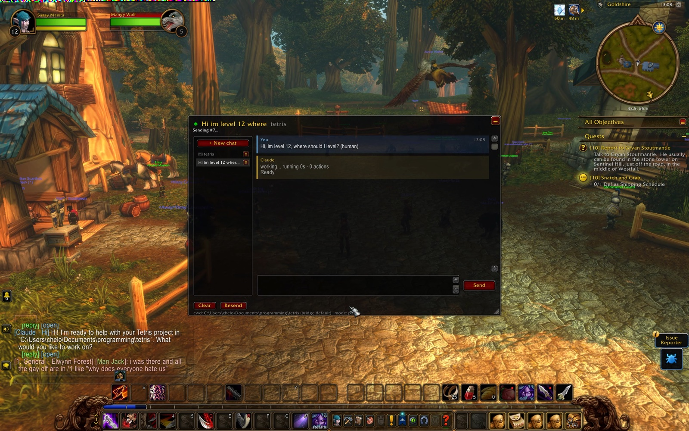

# wow-grok / WoWGrok

<p align="center">
  
</p>

Chat with [xAI Grok API](https://docs.x.ai/) models from inside **World of Warcraft: Forever** — send a task, go back to questing, get pinged in-game when the answer lands. No alt-tabbing, no `/reload` per message.

This is **not** Grok Bot (the in-game / Discord bot) and **not** Claude Code. The companion process calls `POST https://api.x.ai/v1/responses` with your `XAI_API_KEY`. Default model is `grok-4-latest`; `grok-4`, `grok-4.6`, and other xAI chat model ids are valid in config.

- Multiple chats, each its own persistent Grok conversation (`previous_response_id`, with a local history fallback), running in parallel
- Live progress while Grok works: heartbeat, elapsed time
- Replies echoed into the game chat; `/r` replies to Grok when it was the last to message you
- A status light for the bridge, automatic retries, and recovery of your chats if the beta client wipes addon data

Nothing here injects code, reads game memory, or generates input. The addon uses documented addon APIs only; the companion reads your screen and writes ordinary files.

Based on MIT [wow-claude](https://github.com/chelinho139/wow-claude) by chelinho139.

## How it works, in one paragraph

WoW addons are sandboxed: no network, no file reads at runtime. Two doors remain. **Out:** the addon draws your message as a strip of colored 4-pixel squares in the top-left corner of the screen; the bridge screen-captures that corner four times a second and decodes it. **In:** a load-on-demand addon reads its files from disk at the moment it is loaded, so the bridge writes the reply into a pool of 200 pre-made slot addons and the game loads a fresh one from a timer. Cheap "is it ready yet" checks ride on a third trick: an empty `.wav` won't play and a valid one will. Details in [docs/ARCHITECTURE.md](docs/ARCHITECTURE.md).

## Requirements

- **Windows** or **macOS**
- World of Warcraft: Forever (tested on Windows 1.60.1.69913, TOC 16001), **windowed or borderless** — exclusive fullscreen blocks screen capture
- [Node.js](https://nodejs.org) 20 or newer
- An xAI API key (`XAI_API_KEY`). Get one at [console.x.ai](https://console.x.ai/). This is the Grok **API**, not a Grok Bot token.

macOS capture is experimental (Retina / Screen Recording permission — see [docs/INSTALL-MAC.md](docs/INSTALL-MAC.md)).

## Install

### Windows

Step-by-step: [docs/INSTALL-WINDOWS.md](docs/INSTALL-WINDOWS.md). Short version:

```powershell
git clone https://github.com/chelinho139/wow-grok
cd wow-grok
$env:XAI_API_KEY = "xai-..."   # or put apiKey in bridge/config.json after setup
node setup.js --project "C:\path\to\the\project\you\want\to\work\on"
```

### macOS

Step-by-step: [docs/INSTALL-MAC.md](docs/INSTALL-MAC.md). Short version:

```bash
git clone https://github.com/chelinho139/wow-grok
cd wow-grok
export XAI_API_KEY="xai-..."   # or put apiKey in bridge/config.json after setup
node setup.js --project "$HOME/path/to/the/project/you/want/to/work/on"
# if auto-detect misses: --wow "$HOME/Applications/World of Warcraft/_classic_beta_"
```

`setup.js` finds the client (pass `--wow "<flavor folder>"` if it can't), copies the addon into `Interface/AddOns/WoWGrok`, writes `bridge/config.json`, and generates the slot pool and signal files (≈15,000 tiny files; that's normal — the client only discovers addon files at launch, so they have to exist up front).

Then **fully quit and relaunch WoW**, enable *WoW Grok* on the AddOns screen, and start the bridge:

```
npm start               # in the current terminal
```

On Windows, `bridge/start-window.cmd` opens its own window. It restarts itself if it ever crashes. Ctrl+C (or closing the window) stops it.

### `wow-grok`: start it from the project folder

The bridge works in the folder you start it from. Install the command once:

```
npm link          # in the wow-grok folder; makes `wow-grok` available everywhere
```

Then, from any project:

```
cd /path/to/realms
wow-grok
```

Every chat that hasn't picked its own folder now works in `realms`, and the panel's cwd line shows it. `wow-grok --project <dir>` names the folder explicitly; `npm start` inside this repo falls back to `defaultCwd` in the config. Only one bridge can run at a time (two would fight over the screen and the slot files), so this sets the default folder rather than giving you one bridge per project.

## Use

In game: `/wow-grok` opens the window. Until the bridge has answered, a **Connect** button sits where Send would be: start the bridge, click it, and the light turns green (a message typed before that stays in the box). Then click the input box, type, Enter. The reply arrives with the whisper sound; the window's light shows the bridge state (green/yellow/red, hover for details), and **Reconnect** shows up if the bridge goes quiet.

Right-clicking a chat in the left panel opens a small menu with **Rename...** and **Folder...** (right-click again to close it); the trash can on the row deletes the chat after an OK/Cancel confirm. **Folder...** sets this chat's folder label (same as `/wow-grok cd` below); each chat keeps its own.

| Command | What it does |
|---|---|
| `/wow-grok` | toggle the window; the minimize button (top right) or Esc collapses it to a small bar, click the bar to expand |
| `/ai <text>` | send from the normal chat box (`/wow-grok <text>` is the same; `/grok` works too) |
| `/r <text>` | replies to Grok when Grok was the last to message you; otherwise the normal whisper reply |
| `/wow-grok new [name]` | new chat = new Grok conversation. Unnamed chats take their title from your first message |
| `/wow-grok chat <n\|name>` | switch chats (or click the left panel; right-click a row for Rename and Folder, its trash can deletes it) |
| `/wow-grok cd <folder>` | folder label for this chat (**Folder...** after right-clicking the chat opens the same thing as a dialog). Relative to the bridge's folder (`/wow-grok cd realms`, `/wow-grok cd ../other`), `~` works, a full path too; `/wow-grok cd` alone goes back to the bridge's default. A chat that changes folder starts a fresh Grok conversation |
| `/wow-grok reset` | wipe this chat's Grok memory (`previous_response_id`), keep the transcript |
| `/wow-grok rename`, `/wow-grok delete`, `/wow-grok clear` | manage the current chat |
| `/wow-grok echo full\|short\|off\|<chars>` | how much of each reply to print into the game chat (default 4000 chars) |
| `/wow-grok longchat on` | let the game chat box take 4000 characters, for long `/ai` messages |
| `/wow-grok bind <key>` | hotkey: checks for a reply while waiting, otherwise toggles the window |
| `/wow-grok cancel` | stop waiting on this chat's reply |
| `/wow-grok resend` | show the strip again if the bridge missed it |
| `/wow-grok reload` | reload the UI now (also frees the slot pool) |
| `/wow-grok mode reload` | fallback transport that costs a `/reload` per step, if pixels or slots can't work |
| `/wow-grok diag`, `/wow-grok slots` | transport diagnostics |
| `/wow-grok help` | the full list |

Click any message, or `/wow-grok copy` for the last reply, to open it in a selectable box for Ctrl+C.

### Permissions

Grok API chat has **no local tool allowlist**. The bridge cannot run commands or edit files on your machine; it only sends text to xAI and writes the reply into slot files. The in-game **Allow** button is a no-op (it logs a note on the bridge and does not change config). `allowedTools` in `config.json`, if present, is ignored.

## Configuration (`bridge/config.json`)

The keys you are most likely to touch. Every key, flag and environment variable is in [docs/CONFIGURATION.md](docs/CONFIGURATION.md).

| Key | Meaning |
|---|---|
| `apiKey` | xAI API key. Prefer the `XAI_API_KEY` env var; leave this empty. Never commit a real key. |
| `model` | Grok model id. Default `grok-4-latest`. `grok-4`, `grok-4.6`, etc. are valid. |
| `apiBase` | API origin. Default `https://api.x.ai/v1`. |
| `defaultCwd` | folder for chats that haven't been given one with `/wow-grok cd` |
| `maxParallel` | how many chats may call Grok at once (default 3) |
| `capture.processName` | Windows: game exe without `.exe` (`WowB` for Forever). macOS: app name (`World of Warcraft` or `WowB`). Set by `setup.js`. |
| `slots`, `actMax`, `presenceMax` | pool sizes; must match the constants at the top of `WoWGrok.lua` if you change them |
| `timeoutMs` | abort a request that takes longer than this (default 30 min) |

Windows example paths live in `bridge/config.example.json`. On Mac they look like `/Applications/World of Warcraft/_classic_beta_/Interface/AddOns`.

## Troubleshooting

- **Connect says "No answer from the bridge" / light stays red** — is the bridge running? Is the game window on screen and not minimized? Exclusive fullscreen blocks capture. On Mac, grant Screen Recording. `bridge.log` shows `strip #N` when a message is decoded and `strip seen but rejected: ...` when one is misread.
- **Missing xAI API key** — set `XAI_API_KEY` or `apiKey` in `bridge/config.json`. The banner's `api key` line says `env` vs `config.json` vs `MISSING`.
- **Reply never appears but `bridge.log` says `done`** — `/wow-grok slots`; if the pool is empty, `/wow-grok reload` frees it and picks the reply up via the fallback path.
- **"Reply slots not installed"** — `node bridge/install-slots.js`, then restart WoW.
- **Chats vanished after a reload** — the beta client sometimes wipes addon saved data. The bridge keeps `transcripts.json` and sends your chats back automatically on the next message.
- **`/wow-grok diag` says the sound channel is unusable** — the cheap readiness checks and heartbeat are off; everything still works through slot polls, just with coarser progress. If it says a valid file reports as unplayable, WoW hasn't been restarted since the files were created.

## Documentation

- [docs/INSTALL-WINDOWS.md](docs/INSTALL-WINDOWS.md): step-by-step install on a fresh Windows machine
- [docs/INSTALL-MAC.md](docs/INSTALL-MAC.md): macOS install, Screen Recording, Retina
- [docs/CONFIGURATION.md](docs/CONFIGURATION.md): every config key, command-line flag and environment variable
- [docs/ARCHITECTURE.md](docs/ARCHITECTURE.md): how the pixel strip, slot pool and signal files work, and why
- [CONTRIBUTING.md](CONTRIBUTING.md): repo layout, running the tests, conventions
- [CHANGELOG.md](CHANGELOG.md): release notes

## Development

```
npm install
npm test          # portable tests; codec round-trip uses capture.ps1 on Windows, capture-mac.js elsewhere
npm run test:live # runs the bridge in a sandbox with a real xAI Grok API call (needs XAI_API_KEY)
```

Layout: `addon/WoWGrok` is the addon, `bridge/` the companion (`bridge.js` does I/O, `xai.js` talks to the Grok API, `protocol.js` is the pure part), `docs/` the design and reference, `tests/` the checks. After editing the addon, copy it into the game folder (`node setup.js` does that too) and `/reload`. What each test covers, and the conventions for changes, are in [CONTRIBUTING.md](CONTRIBUTING.md).

## Credits

- Fork of [chelinho139/wow-claude](https://github.com/chelinho139/wow-claude) (MIT). That project drives local Claude Code; this fork drives the xAI Grok API and adds experimental macOS capture.
- [0xInuarashi's wow-forever-codex](https://github.com/0xinuarashi/wow-forever-codex) measured the client's file-loading rules on a live Forever build (files must exist at launch; a not-yet-loaded file is read fresh on first use) and pioneered the pixel-out channel for Codex, with a font-metrics return channel. This project uses the same rules with load-on-demand addons instead of fonts.
- [Gethe/wow-ui-source](https://github.com/Gethe/wow-ui-source) — Blizzard's UI code, `forever` branch, used to verify every API this addon calls.

## License

MIT — see [LICENSE](LICENSE).
